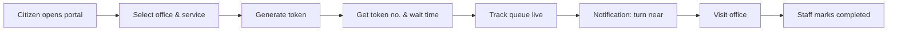

# User Flow

```mermaid
flowchart LR
  A[Citizen opens portal] --> B[Select office & service]
  B --> C[Generate token]
  C --> D[Get token no. & wait time]
  D --> E[Track queue live]
  E --> F[Notification: turn near]
  F --> G[Visit office]
  G --> H[Staff marks completed]
```